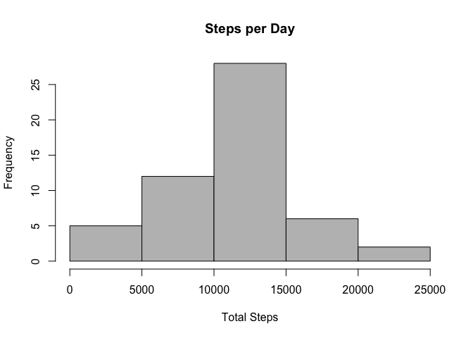
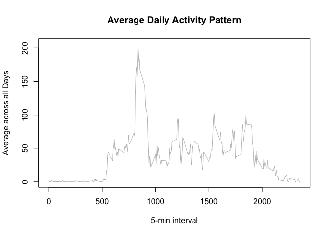
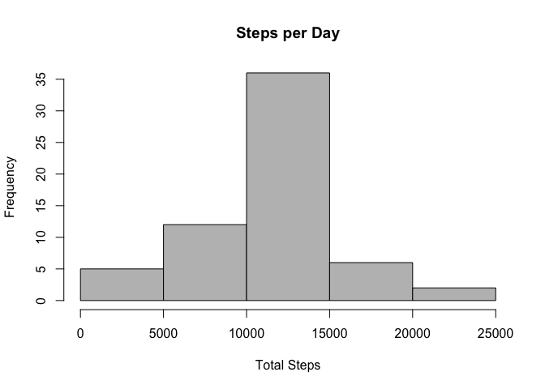
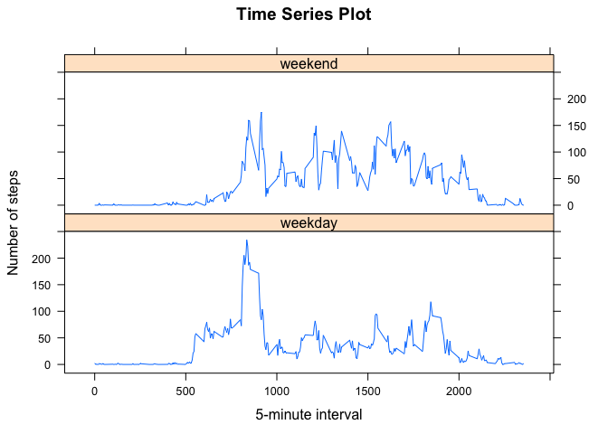

# Reproducible Research: Peer Assessment 1
## Loading Libraries

```r
library(RCurl)
```

```
## Loading required package: bitops
```

```r
library(knitr)
```

```
## Warning: package 'knitr' was built under R version 3.1.3
```

```r
library(lattice)
```

## Loading and preprocessing the data

### Check if file exists in expected path, if it doesn't download it and unzip it 

```r
if (!file.exists("activity.csv")) {
  fileURL = "https://d396qusza40orc.cloudfront.net/repdata%2Fdata%2Factivity.zip"
  download.file(fileURL, "repdata-data-activity.zip", method = "curl")
  unzip("repdata-data-activity.zip", overwrite = T, exdir = ".")
}

activity <- read.table("activity.csv", header = TRUE, sep=",")

activity$date <- as.Date(activity$date, format="%Y-%m-%d")
```

## What is mean total number of steps taken per day?


*Calculate total number of steps*

```r
totalSteps <- aggregate(steps ~ date, data = activity, sum, na.rm = TRUE)
```
###1. Make a histogram of the total number of steps taken each day

```r
hist(totalSteps$steps, main = "Steps per Day", xlab = "Total Steps", ylab = "Frequency", col = "grey")
```

 

###2. Calculate and report the mean and median total number of steps taken per day

```r
mean(totalSteps$steps)
```

```
## [1] 10766.19
```

```r
median(totalSteps$steps)
```

```
## [1] 10765
```
## What is the average daily activity pattern?

###1.Make a time series plot (i.e. type = "l") of the 5-minute interval (x-axis) and the average number of steps taken, averaged across all days (y-axis)

```r
tm <- tapply(activity$steps, activity$interval, mean, na.rm = TRUE)
plot(row.names(tm), tm, type = "l", main = "Average Daily Activity Pattern", xlab = "5-min interval", ylab = "Average across all Days", col = "grey")
```

 

## Imputing missing values
###1. Calculate and report the total number of missing values in the dataset

```r
sum(is.na(activity))
```

```
## [1] 2304
```

###2. Devise a strategy for filling in all of the missing values in the dataset. The strategy does not need to be sophisticated.
The strategy will be using the mean function to fill the missing values.

###3. Create a new dataset that is equal to the original dataset but with the missing data filled in.

```r
copyActivity <- activity

copyActivity = transform(copyActivity, steps= ifelse(is.na(steps), mean(steps, na.rm=TRUE), steps))
```
###4. Make a histogram of the total number of steps taken each day and Calculate and report the mean and median total number of steps taken per day.

```r
totalStepsCA <- aggregate(steps ~ date, data = copyActivity, sum, na.rm = TRUE)
hist(totalStepsCA$steps, main = "Steps per Day", xlab = "Total Steps", ylab = "Frequency", col = "grey")
```

 

```r
mean(totalStepsCA$steps)
```

```
## [1] 10766.19
```

```r
median(totalStepsCA$steps)
```

```
## [1] 10766.19
```
## Are there differences in activity patterns between weekdays and weekends?

###1.Create a new factor variable in the dataset with two levels – “weekday” and “weekend” indicating whether a given date is a weekday or weekend day.

```r
d <- weekdays(activity$date)
activity$type_date <- ifelse(d == "Saturday" | d == "Sunday", "weekend", "weekday")
```

###2. Make a panel plot containing a time series plot (i.e. type = "l") of the 5-minute interval (x-axis) and the average number of steps taken, averaged across all weekday days or weekend days (y-axis).

```r
aggregateSteps <- aggregate(steps ~ interval + type_date, data = activity, mean)
names(aggregateSteps) <- c("interval", "type_date", "steps")
xyplot(steps~interval | type_date, aggregateSteps,type="l",layout=c(1,2), main="Time Series Plot", xlab="5-minute interval",ylab = "Number of steps")
```

 

